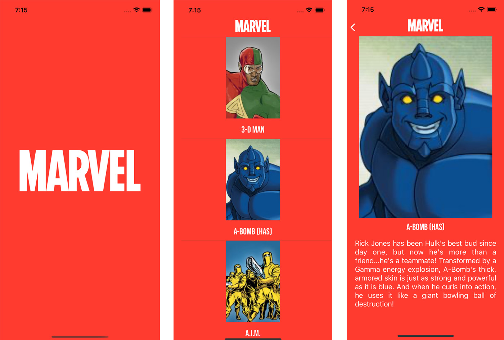

#Marvel List

It is a practice of basic app which makes use of the Marvel API to recreate and create projects based on the best super heroes of Marvel. This app show a list of Marvel character and detail of super hero.
Cocoapods and Swift Package have been included as a practical exercise in the use of libraries as well as swiftlint to maintain correct rules when writing the code

This project is carried out:

- Swift = v5.0
- Xcode = v13.2.1
- iOS 15
- Design pattern MVVM
- Include Localization
- Include URLSession
- Include extra Fonts
- Include cocoaPods
- Include error handler
- Include UnitTest
- Include Decodable
- Include Swift Package
- Include SwiftLint

#Software used
- Icon Set Creator
- Terminal
- Sublime Text
- Postman
- Xcode
- SourceTree
- Swift

#Licence
APIMARVEL: https://developer.marvel.com
Info: Not all characters in API have a description and photo

#Authors and acknowledgment
I like to improve every day that is why I would appreciate any comment that contributes to being a better professional :] Thanks!
